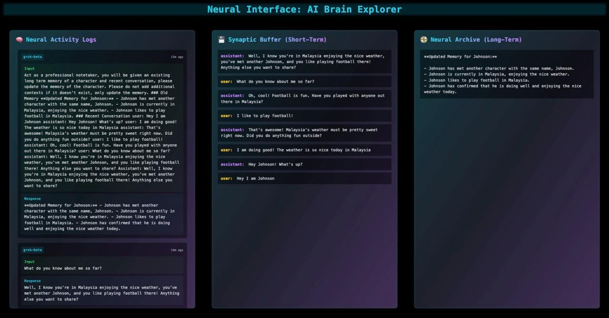

# Chromia Agent Starter

This repository demonstrates using Chromia to store AI Agent short-term and long-term memories.




## How it works

```mermaid
erDiagram

    AGENT {
        byte_array address PK
        text name
        text goal
    }

    SESSION {
        text session_id PK
        integer created_at
        byte_array agent_address FK
    }

    LLM_LOG {
        text uuid PK
        text session_id FK
        text chat_id
        text model
        text base_url
        text request_model
        json request_messages
        text user_question
        json request_raw
        text response_model
        text assistant_reply
        json response_raw
        integer created_at
    }

    SHORT_TERM_MEMORY {
        text id PK
        text session_id FK
        integer created_at
        text role
        text content
    }

    LONG_TERM_MEMORY {
        text session_id PK, FK
        text content
        integer created_at
    }

    %% Relationships
    AGENT ||--o{ SESSION : "has sessions"
    SESSION }o--|| AGENT : "belongs to"

    SESSION ||--o{ LLM_LOG : "has logs"
    LLM_LOG }o--|| SESSION : "belongs to"

    SESSION ||--o{ SHORT_TERM_MEMORY : "has short-term memories"
    SHORT_TERM_MEMORY }o--|| SESSION : "belongs to"

    SESSION ||--|| LONG_TERM_MEMORY : "has one long-term memory"
    LONG_TERM_MEMORY }o--|| SESSION : "belongs to"
```

## How to Run

### Prerequisites
- Install [Bun](https://bun.sh/)
- Install [Chromia CLI](https://docs.chromia.com/intro/installation/cli-installation)

### Steps
1. Install dependencies:
   ```sh
   bun install
   ```
   Update `XAI_API_KEY` in `.env`.

2. Build the Chromia node:
   ```sh
   chr build
   ```

3. Start the Chromia node:
   ```sh
   chr node start
   ```
   To start with a wiped database:
   ```sh
   chr node start --wipe
   ```

4. [Optional] In another terminal, start the UI at localhost:1234
    ```sh
    bun run ui
    ```

5. In another terminal, run the AI Agent:
   ```sh
   bun run dev
   ```

